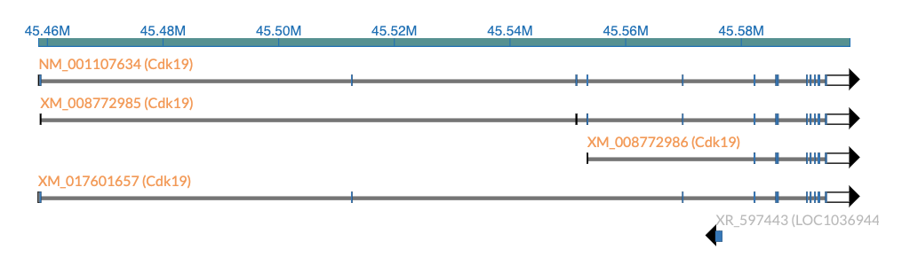

# genomefeatures

[![npm package][npm-badge]][npm]

[](https://github.com/GMOD/genomefeatures/actions?query=branch%3Amain+workflow%3APush+)

[npm-badge]: https://img.shields.io/npm/v/genomefeatures.png?style=flat-square
[npm]: https://www.npmjs.com/package/genomefeatures

# Screenshot



## Demo

Demo https://gmod.org/genomefeatures/

Storybook https://gmod.org/genomefeatures/storybook

# Instructions

Install from NPM

```bash
yarn add genomefeatures
```

Or see see [example/index.html](example/index.html) for CDN import style usage,
e.g.

## Loading data

### Legacy access pattern - Apollo REST API

The original implementation of this component required fetching data from an
Apollo REST API endpoint. This is still supported, though it is a overkill for
most usages

```typescript
import {
  fetchApolloAPIData,
  parseLocString,
  GenomeFeatureViewer,
} from 'genomefeatures'

// if your bundler let's you import CSS, you can do this, otherwise see CDN usage example
import 'genomefeatures/style.css'

const BASE_URL = 'https://www.alliancegenome.org/apollo'
const locString = '2L:130639..135911'
const genome = 'fly'
const region = parseLocString(locString)

const trackData = await fetchApolloAPIFeatures({
  region,
  genome,
  track: 'All Genes',
  baseUrl: `${BASE_URL}/track/`,
})

const variantData = await fetchApolloAPIFeatures({
  region,
  genome,
  track: 'Variants',
  baseUrl: `${BASE_URL}/vcf/`,
})

const gfc = new GenomeFeatureViewer(
  {
    region,
    genome,
    tracks: [
      {
        type: 'ISOFORM_EMBEDDED_VARIANT',
        trackData,
        variantData,
      },
    ],
  },
  `#svgelement`,
  900,
  500,
)
```

And then in your HTML

```html
<svg id="svgelement"></svg>
```

### Static access pattern - Accessing JBrowse NCList files and VCF tabix files

After the refactor, we can now fetch files from static files like JBrowse 1
NCList and VCF tabix files. This means you do not need a complex apollo
deployment to use this component: just some static files

```typescript
import {
  fetchNCListData,
  fetchTabixVcfData,
  parseLocString,
  GenomeFeatureViewer,
} from 'genomefeatures'

// if your bundler let's you import CSS, you can do this, otherwise see CDN usage example
import 'genomefeatures/style.css'

const locString = '2L:130639..135911'
const genome = 'fly'

const vcfTabixUrl =
  'https://s3.amazonaws.com/agrjbrowse/VCF/7.0.0/fly-latest.vcf.gz'
const ncListUrlTemplate =
  'https://s3.amazonaws.com/agrjbrowse/docker/7.0.0/FlyBase/fruitfly/tracks/All_Genes/{refseq}/trackData.jsonz'

const region = parseLocString(locString)
const trackData = await fetchNCListData({
  region,
  urlTemplate: ncListUrlTemplate,
})

const variantData = await fetchTabixVcfData({
  url: vcfTabixUrl,
  region,
})

const gfc = new GenomeFeatureViewer(
  {
    region,
    genome,
    tracks: [
      {
        type: 'ISOFORM_EMBEDDED_VARIANT',
        trackData,
        variantData,
      },
    ],
  },
  `#svgelement`,
  900,
  500,
)
```

And then in your HTML

```html
<svg id="svgelement"></svg>
```

## Developers

```bash
git clone git@github.com:GMOD/genomefeatures
yarn dev # vite demo
yarn storybook # storybook examples
```

## Notes

Originally called https://github.com/GMOD/GenomeFeatureComponent

Created by Nathan Dunn (@nathandunn), used by Alliance of Genome Resources

Updated in 2025 by Colin Diesh (@cmdcolin) to add ability to fetch from static
files

See also https://github.com/GMOD/react-genomefeatures
